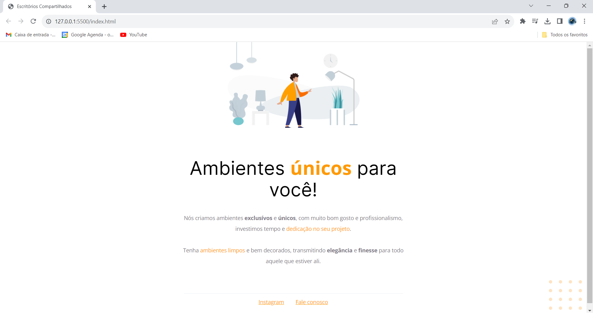

# Escritórios Compartilhados

***Este projeto foi desenvolvido como parte do curso da Rocketseat, visando aprimorar meus conhecimentos em programação web. O objetivo é demonstrar minhas habilidades e aprendizados adquiridos durante o curso.***

Bem-vindo ao repositório do projeto "Escritórios Compartilhados"! Este é um site desenvolvido para proporcionar uma experiência única e exclusiva ao usuário. Abaixo, você encontrará informações sobre as tecnologias utilizadas, estrutura do código, responsividade e muito mais.

## Tecnologias Utilizadas

### Linguagens:

- **HTML**: O documento está estruturado em HTML5, garantindo semântica e acessibilidade.
- **CSS**: Estilizado com CSS3 para proporcionar um layout atraente e responsivo.

### Frameworks e Bibliotecas:

- **Google Fonts**: Utilizado para incorporar as fontes "Inter" e "Open Sans", trazendo elegância à tipografia do site.

### Responsividade:

O site foi desenvolvido com foco na experiência do usuário em diferentes dispositivos. As seguintes técnicas foram aplicadas:

- **Viewport Meta Tag**: Configurada para garantir que o site seja dimensionado corretamente em dispositivos móveis.
- **Media Queries**: Utilizadas para ajustar o layout em diferentes tamanhos de tela, proporcionando uma experiência consistente.

## Estrutura do Código

O código HTML está dividido em seções que representam as principais partes do site:

1. **Head**: Contém metadados e links para as fontes utilizadas.
2. **Body**: Estrutura do conteúdo, incluindo cabeçalho, seção principal e rodapé.
3. **CSS**: O arquivo `style.css` é responsável pela estilização do site, aplicando estilos a elementos específicos.

### Demonstração de Conhecimentos em Programação

Na construção deste projeto, utilizei tags semânticas e outras práticas recomendadas para garantir uma estrutura HTML clara e acessível. Além disso, explorei variáveis CSS, seletores universais, animações e transições para criar uma interface atraente e interativa.

## Responsividade

O design responsivo é crucial para atender a uma variedade de dispositivos. Algumas estratégias adotadas incluem:

- **Unidades Relativas**: Utilização de unidades como porcentagem e `min()` para garantir flexibilidade.
- **Media Queries**: Adaptações específicas para diferentes breakpoints, garantindo uma experiência amigável em dispositivos variados.

## Acessibilidade

Busquei seguir as melhores práticas de acessibilidade, utilizando semântica HTML, descrições alt em imagens e cores de fácil leitura para garantir que o site seja acessível a todos.

## Grupo de Estudos

Criei um grupo de estudos no WhatsApp para pessoas que estão estudando desenvolvimento web. Se você estiver interessado em compartilhar conhecimento e tirar dúvidas entre os membros, sinta-se à vontade para entrar em contato! Você pode me chamar no número 21 986960700.

**Foco do Grupo:**
- Compartilhamento de conhecimento.
- Discussões sobre desenvolvimento web.
- Tirar dúvidas e colaborar com outros membros.
  
**Agradeço por visitar nosso repositório!**
